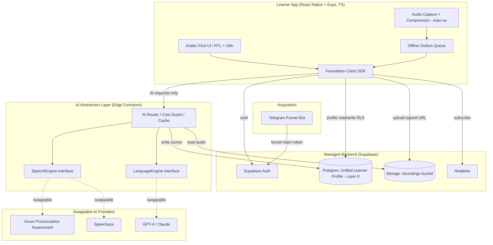
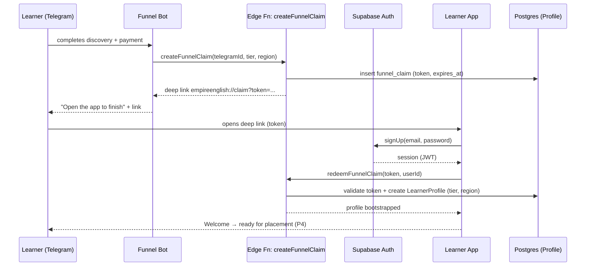
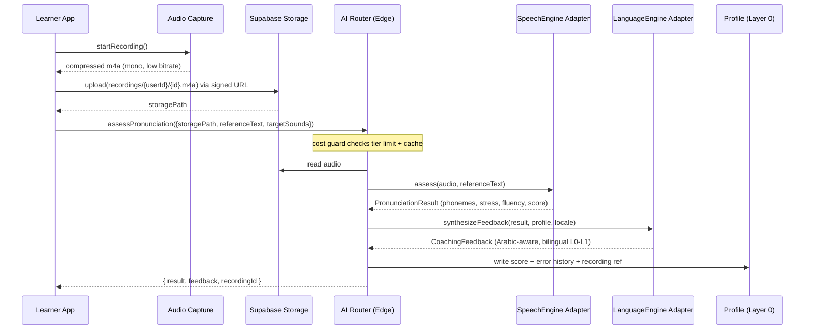
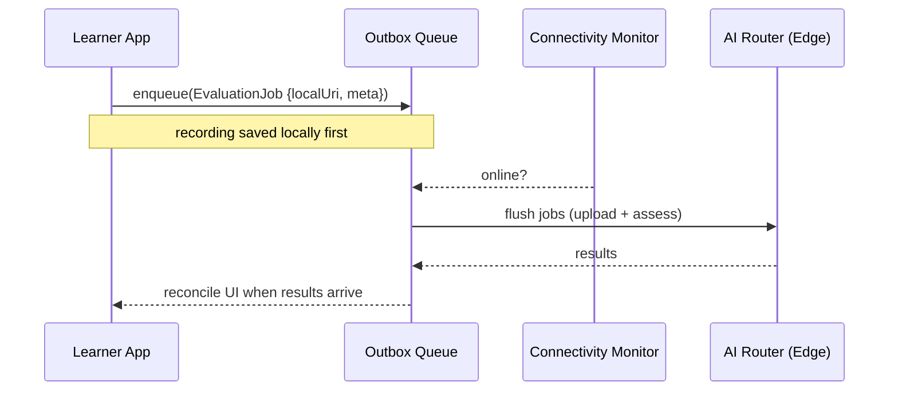

# Design Document: Foundation & Infrastructure (Project P1)

> **Source of truth:** `EMPIRE-ENGLISH-BLUEPRINT-V2.md` (Master Blueprint V2.0) and `EMPIRE-ENGLISH-EXECUTION-PLAN.md` (Project P1).
> **Scope:** Phase 1 MVP backbone only. This project builds the technical foundation that P2 (AI Engine), P3 (App Shell), P4 (Placement), P5 (Accent Engine), P6 (Core Daily Loop), P7 (Pronunciation Reference), and P8 (Telegram Funnel) all depend on. It does **not** implement any Phase 2+ feature (live voice rooms, full daily loop, marketplace, multi-L1 localization, etc.).

---

## Overview

Foundation & Infrastructure (P1) is the technical backbone of Empire English. It locks the tech stack, stands up the **Unified Learner Profile (Layer 0)** as the single source of truth, provides **authentication and account creation** (including entry from the Telegram acquisition funnel), provides **audio storage** for learner recordings (with low-data/compression handling for MENA mobile), and — most importantly — defines the **AI Abstraction Layer**: the internal, provider-agnostic interface through which *every* AI call routes (a Speech Engine interface and a Language Engine interface) so vendors are swappable with zero app disruption.

P1 builds *from scratch*. The existing Expo app (`/app`, `/src`) and Telegram assistant (`/telegram-assistant`) may be evolved, but nothing is assumed already built. The design deliberately favors **managed services and a single codebase** so a solo founder can ship and operate it alone, and it is engineered to keep **per-evaluation AI cost** inside the feasibility model defined in the Blueprint (Section 11.4 / 10.5).

This document combines a **high-level design** (architecture, sequence diagrams, components, data models) with the **key low-level design** (concrete data schemas, the swappable AI interfaces, and function/API signatures) needed to begin building.

---

## 1. Tech Stack Decision

This section confirms and justifies the Blueprint's recommended stack. These are the **locked** Phase 1 decisions for P1.

| Layer | Decision | Justification (solo-founder, MENA-mobile, cost-aware) |
|-------|----------|--------------------------------------------------------|
| **Learner App** | **React Native + Expo** (TypeScript, Expo Router) — evolves the existing app | One codebase → iOS + Android + web. Managed Expo workflow (EAS) removes native build/ops burden. Repo is already Expo + TypeScript + expo-router. |
| **i18n / RTL** | `i18next` + `react-i18next` + `expo-localization`, RTL via `I18nManager` | Arabic-first UI (Refinement #1) for L0–L1 learners; English-toggle default as learners climb. |
| **Backend / Data** | **Supabase** — Postgres (profile), Auth, Storage (audio), Realtime | Single managed backend covers DB + auth + file storage + realtime. Row-Level Security enforces per-learner isolation. Avoids stitching 4 vendors together solo. The Unified Learner Profile lives in Postgres. |
| **Auth** | Supabase Auth (email/password + OTP) + a server-minted **funnel claim token** | Account creation from the Telegram funnel without sharing service keys with the bot. |
| **Audio Storage** | Supabase Storage bucket `recordings` (private) + signed URLs | Object storage with per-user path isolation; signed URLs for before/after replay. |
| **Audio capture/encode** | `expo-av` recording → compressed `m4a/AAC` (mono, ~16 kHz, low bitrate) | Low-data mode (Refinement #3): small files for MENA mobile, fast upload, cheap storage. |
| **Speech Engine (provider)** | **Azure Pronunciation Assessment** (primary), **Speechace** (alternative) | Specialized phoneme/stress/fluency scoring. Both hidden behind the AI Abstraction Layer so either can be swapped in. |
| **Language Engine (provider)** | **GPT-4 / Claude-class LLM** via API | Feedback synthesis, content generation, writing correction. Hidden behind the AI Abstraction Layer. |
| **AI routing** | **Edge Functions** (Supabase Edge / serverless) host the AI Abstraction Layer | Provider API keys never ship in the app. All AI calls route server-side → key safety, cost control, caching, rate limiting per tier. |
| **Acquisition Bot** | Telegram bot (evolves existing `telegram-assistant/`) | Already exists as a Cloudflare Worker; P1 only adds the secure account-creation handoff into the app. |
| **Local state / offline** | `@react-native-async-storage/async-storage` + an outbox queue | Connectivity-resilient (Refinement #3): queue evaluations and writes, sync when online. |

**Boundary note (anti-lock-in):** the app talks only to *our* backend (Supabase + our Edge Functions). It never calls Azure/Speechace/OpenAI/Anthropic directly. Swapping a provider is a server-side config + adapter change, invisible to the app.

---

## 2. Architecture

### 2.1 System Architecture (high-level)



### 2.2 The Five-Layer Mapping (what P1 provides)

P1 stands up the **foundation slice** of the Blueprint's five-layer architecture. It fully owns Layer 0 and the AI Engine boundary; it provides the *hooks* (read/write contracts) that later projects fill in.

| Blueprint Layer | P1 responsibility | Deferred to |
|-----------------|-------------------|-------------|
| **Layer 0 — Unified Learner Profile** | Full data model, schema, access SDK, RLS | — (owned by P1) |
| Layer 1 — Progression Engine | Profile *fields* exist (level, sub-level); logic not built | P4 |
| Layer 2 — Execution Engine | Recording → storage → AI plumbing exists; daily loop not built | P6 |
| Layer 3 — Community Engine | — | Phase 2 |
| **Layer 4 — AI Engine** | Abstraction Layer + Speech/Language interfaces + router | provider wiring in P2 |
| Acquisition | Secure account-creation handoff from the bot | full funnel in P8 |

---

## 3. Component Sequence Diagrams

### 3.1 Account creation from the Telegram funnel



### 3.2 Recording capture → storage → AI evaluation (the foundation pipeline)



### 3.3 Offline-resilient evaluation (low-data / unstable connection)



---

## 4. Data Models — Unified Learner Profile (Layer 0)

The Unified Learner Profile is the **single source of truth**. Every other layer reads/writes here. This section gives both the TypeScript domain model (used by the app SDK) and the Postgres schema (the storage of record).

### 4.1 Core Interfaces / Types (TypeScript)

```typescript
// ─────────────────────────────────────────────────────────────
// Layer 0 — Unified Learner Profile (domain model)
// The single source of truth. All personalization flows from this.
// ─────────────────────────────────────────────────────────────

export type UUID = string;
export type ISODateTime = string; // e.g. "2026-06-17T21:00:00Z"

/** Blueprint §2.1 — 4 levels, each with 3 sub-levels. */
export type Level = 0 | 1 | 2 | 3;
export type SubLevel =
  | "0.1" | "0.2" | "0.3"
  | "1.1" | "1.2" | "1.3"
  | "2.1" | "2.2" | "2.3"
  | "L3.Silver" | "L3.Gold" | "L3.Platinum";

/** Value Ladder roles (Blueprint §10.1). */
export type Tier = "gate" | "recruit" | "builder" | "empire" | "vip";

/** Two price-books run simultaneously, detected by region (Blueprint §10.5). */
export type Region = "egypt" | "international";

/** Arabic dialect tendency — drives dialect-aware /θ/–/ð/ coaching (Refinement #6). */
export type DialectTendency = "msa" | "egyptian" | "levantine" | "gulf" | "maghrebi" | "unknown";

/** UI language preference — Arabic-first for L0–L1, English-toggle as they climb (Refinement #1). */
export type UiLocale = "ar" | "en";

/** Target sounds for the Arabic-L1 accent track (Blueprint §2.2 / §5). */
export type TargetSound =
  | "p_b" | "v_f" | "ng" | "th_voiceless" | "th_voiced" // L0
  | "ih_iy" | "ae_uh" | "uh_uw" | "word_stress"          // L1
  | "clusters" | "linking" | "schwa"                      // L2
  | "flap_t" | "dark_l" | "intonation" | "stress_timing"; // L3

/** Per-target-sound accent mastery (0–100). Seeded by placement (P4), updated each evaluation. */
export interface AccentSoundScore {
  sound: TargetSound;
  score: number;            // 0–100
  attempts: number;
  lastEvaluatedAt: ISODateTime | null;
}

/** The learner's personal accent plan + always-visible Accent Score (Blueprint §5.5). */
export interface AccentProfile {
  overallAccentScore: number;        // 0–100
  dialectTendency: DialectTendency;
  targetSounds: AccentSoundScore[];  // personal target-sound hit list
  weakestSound: TargetSound | null;  // tomorrow's drill auto-targets this
  wordStress: number;                // 0–100
  linking: number;                   // 0–100
  rhythm: number;                    // 0–100
  intonation: number;                // 0–100
}

/** Per-skill scores feeding the dashboard radar + WPS (Blueprint §8). */
export interface SkillScores {
  speakingFluency: number;   // 0–100
  listening: number;         // 0–100
  vocabulary: number;        // 0–100
  grammar: number;           // 0–100
  writing: number;           // 0–100
}

/** One logged error → builds the personal Error Log / cheat sheets (Blueprint §6). */
export interface ErrorRecord {
  id: UUID;
  category: "phoneme" | "stress" | "grammar" | "vocabulary" | "fluency";
  detail: string;            // e.g. "park→bark (/p/ devoiced to /b/)"
  relatedSound: TargetSound | null;
  occurredAt: ISODateTime;
  recordingId: UUID | null;  // link to the audio that produced it
  resolved: boolean;
}

/** Streak — rewards the Core path; Ramadan-flexible (Blueprint §4.2 / Refinement #5). */
export interface StreakState {
  current: number;
  longest: number;
  lastCoreDayAt: ISODateTime | null;
  ramadanMode: boolean;      // fasting learners aren't penalized
}

/** Reference to a stored recording (audio archive + before/after replay). */
export interface RecordingRef {
  id: UUID;
  storagePath: string;       // recordings/{userId}/{id}.m4a
  kind: "baseline" | "placement" | "drill" | "mission" | "assessment" | "milestone";
  referenceText: string | null;
  durationMs: number;
  byteSize: number;
  createdAt: ISODateTime;
  accentScoreAtTime: number | null; // enables Day-1 vs today before/after replay
}

/** THE single source of truth — one row per learner. */
export interface LearnerProfile {
  userId: UUID;              // = Supabase auth user id
  // identity & onboarding
  displayName: string;
  uiLocale: UiLocale;
  region: Region;
  tier: Tier;
  telegramId: string | null; // set when arriving via the funnel
  createdAt: ISODateTime;
  // progression
  level: Level;
  subLevel: SubLevel;
  placementCompleted: boolean;
  // performance
  skillScores: SkillScores;
  accentProfile: AccentProfile;
  errorHistory: ErrorRecord[];
  streak: StreakState;
  // audio
  recordings: RecordingRef[];
}
```

### 4.2 Postgres Schema (storage of record)

```sql
-- Layer 0 backbone. RLS ensures a learner can only touch their own row.
create type tier_t          as enum ('gate','recruit','builder','empire','vip');
create type region_t        as enum ('egypt','international');
create type dialect_t       as enum ('msa','egyptian','levantine','gulf','maghrebi','unknown');
create type ui_locale_t     as enum ('ar','en');
create type recording_kind_t as enum ('baseline','placement','drill','mission','assessment','milestone');

create table learner_profile (
  user_id            uuid primary key references auth.users(id) on delete cascade,
  display_name       text not null,
  ui_locale          ui_locale_t not null default 'ar',
  region             region_t    not null,
  tier               tier_t      not null default 'gate',
  telegram_id        text unique,
  level              smallint    not null default 0 check (level between 0 and 3),
  sub_level          text        not null default '0.1',
  placement_completed boolean    not null default false,
  -- performance (JSONB for flexible sub-structures, validated app-side)
  skill_scores       jsonb       not null default '{}'::jsonb,
  accent_profile     jsonb       not null default '{}'::jsonb,
  streak             jsonb       not null default '{"current":0,"longest":0,"ramadanMode":false}'::jsonb,
  created_at         timestamptz not null default now(),
  updated_at         timestamptz not null default now()
);

-- Error history: high-volume + queryable → its own table.
create table error_record (
  id            uuid primary key default gen_random_uuid(),
  user_id       uuid not null references learner_profile(user_id) on delete cascade,
  category      text not null,
  detail        text not null,
  related_sound text,
  recording_id  uuid,
  resolved      boolean not null default false,
  occurred_at   timestamptz not null default now()
);
create index on error_record (user_id, occurred_at desc);

-- Recording archive: metadata in Postgres, bytes in Storage.
create table recording_ref (
  id                   uuid primary key default gen_random_uuid(),
  user_id              uuid not null references learner_profile(user_id) on delete cascade,
  storage_path         text not null,
  kind                 recording_kind_t not null,
  reference_text       text,
  duration_ms          integer not null,
  byte_size            integer not null,
  accent_score_at_time smallint,
  created_at           timestamptz not null default now()
);
create index on recording_ref (user_id, kind, created_at desc);

-- Funnel handoff (Telegram → app). Short-lived, single-use.
create table funnel_claim (
  token       text primary key,
  telegram_id text not null,
  tier        tier_t not null,
  region      region_t not null,
  redeemed_by uuid references auth.users(id),
  expires_at  timestamptz not null,
  created_at  timestamptz not null default now()
);

-- Row-Level Security
alter table learner_profile enable row level security;
alter table error_record   enable row level security;
alter table recording_ref  enable row level security;

create policy own_profile on learner_profile
  using (auth.uid() = user_id) with check (auth.uid() = user_id);
create policy own_errors on error_record
  using (auth.uid() = user_id) with check (auth.uid() = user_id);
create policy own_recordings on recording_ref
  using (auth.uid() = user_id) with check (auth.uid() = user_id);
```

**Validation rules:**
- `level` ∈ [0,3]; `sub_level` must be one of the 12 valid sub-levels.
- `accent_profile.targetSounds[*].score`, all `skill_scores.*`, and `accent_profile.overallAccentScore` ∈ [0,100].
- `funnel_claim.token` is single-use (`redeemed_by` set on first redemption) and expires (`expires_at`, default 72h).
- `recording_ref.storage_path` MUST be prefixed `recordings/{user_id}/` (enforced by Storage policy + app-side).
- A profile row is created exactly once per `user_id` (idempotent bootstrap).

---

## 5. AI Abstraction Layer (no vendor lock-in)

This is the heart of P1. **Every** AI call in the entire system routes through these two interfaces, hosted in Edge Functions. The app never imports a provider SDK. Providers are swapped by registering a different adapter behind the same interface — zero app disruption (Blueprint §11.3).

### 5.1 Provider-agnostic interfaces

```typescript
// ─────────────────────────────────────────────────────────────
// AI Abstraction Layer — the ONLY way AI is accessed.
// Providers implement these interfaces; the app depends on the interface, never the provider.
// ─────────────────────────────────────────────────────────────

/** Normalized, provider-independent pronunciation result (Blueprint §5.3 / §11.1). */
export interface PhonemeScore {
  phoneme: string;       // IPA, e.g. "/p/"
  accuracy: number;      // 0–100
  expected: string;      // expected phoneme
  actual: string | null; // detected substitution, e.g. "/b/" for park→bark
}

export interface WordScore {
  word: string;
  accuracy: number;        // 0–100
  stressCorrect: boolean;  // word-stress placement
  phonemes: PhonemeScore[];
}

export interface PronunciationResult {
  overallScore: number;    // 0–100 (the Accent Score input)
  fluency: number;         // 0–100
  completeness: number;    // 0–100 (how much of referenceText was spoken)
  words: WordScore[];
  provider: string;        // which adapter produced this (audit/observability)
}

export interface AssessRequest {
  audioStoragePath: string;     // recordings/{userId}/{id}.m4a
  referenceText: string;        // what they were asked to say
  targetSounds?: TargetSound[]; // focus sounds for this drill
  locale?: "en-US";
}

/** SPEECH ENGINE INTERFACE — audio in → per-phoneme/stress/fluency/score out.
 *  Implemented by: AzurePronunciationAdapter (primary), SpeechaceAdapter (alternative). */
export interface SpeechEngine {
  readonly name: string;
  assess(req: AssessRequest): Promise<PronunciationResult>;
}

// ── Language Engine ──────────────────────────────────────────

export interface CoachingFeedback {
  summary: string;            // warm, Arabic-aware coaching
  bilingual: boolean;         // true for L0–L1 (Arabic clarifications), false L2+
  mechanicsTips: string[];    // how to fix the weakest sound
  encouragement: string;
  provider: string;
}

export interface FeedbackRequest {
  result: PronunciationResult;
  profileSnapshot: Pick<LearnerProfile, "level" | "uiLocale" | "accentProfile">;
  locale: UiLocale;           // controls bilingual scaffolding
}

export interface GenerationRequest {
  task: "writing_correction" | "content_generation" | "feedback_synthesis" | "conversation";
  prompt: string;             // filled from the Prompt Library (Blueprint §11.6)
  variables?: Record<string, string | number>;
  maxTokens?: number;
}

export interface GenerationResult {
  text: string;
  provider: string;
  tokensUsed: number;         // for cost accounting
}

/** LANGUAGE ENGINE INTERFACE — LLM for feedback synthesis, content, writing correction.
 *  Implemented by: OpenAiAdapter, AnthropicAdapter (swappable). */
export interface LanguageEngine {
  readonly name: string;
  synthesizeFeedback(req: FeedbackRequest): Promise<CoachingFeedback>;
  generate(req: GenerationRequest): Promise<GenerationResult>;
}
```

### 5.2 Router, provider registry & cost guard

```typescript
/** Registry lets us swap providers via config — no app/code change at call sites. */
export interface AiProviderRegistry {
  speech(): SpeechEngine;     // returns the currently configured Speech adapter
  language(): LanguageEngine; // returns the currently configured Language adapter
}

/** Per-tier limits keep per-evaluation cost inside the feasibility model (Blueprint §10.5, §11.4). */
export interface CostGuard {
  /** Throws/denies when a tier's daily AI allowance is exceeded. */
  checkAllowance(userId: UUID, tier: Tier, op: "speech" | "language"): Promise<void>;
  recordUsage(userId: UUID, op: "speech" | "language", units: number): Promise<void>;
}

/** The single entry point the app calls. Handles cost guard, cache, provider routing, profile writes. */
export interface AiRouter {
  assessPronunciation(userId: UUID, req: AssessRequest): Promise<{
    result: PronunciationResult;
    feedback: CoachingFeedback;
    recordingId: UUID;
  }>;
  generate(userId: UUID, req: GenerationRequest): Promise<GenerationResult>;
}
```

**Why a router, not direct interface calls:** the router centralizes (1) tier-based cost limits, (2) caching of reusable LLM content (Blueprint §11.4), (3) writing scores + error history back to Layer 0, and (4) provider selection. Swapping Azure → Speechace or GPT-4 → Claude is a one-line registry change.

---

## 6. Foundation Client SDK & API Signatures

The app uses a thin typed SDK so screens never touch Supabase/Edge details directly. This is the contract P3 (App Shell) and all feature projects build on.

```typescript
// Auth & account creation
export interface AuthApi {
  signUp(email: string, password: string): Promise<{ userId: UUID }>;
  signIn(email: string, password: string): Promise<{ userId: UUID }>;
  signOut(): Promise<void>;
  redeemFunnelClaim(token: string, userId: UUID): Promise<LearnerProfile>; // funnel entry
  getSession(): Promise<{ userId: UUID } | null>;
}

// Unified Learner Profile (Layer 0) access
export interface ProfileApi {
  get(userId: UUID): Promise<LearnerProfile>;
  bootstrap(userId: UUID, seed: Partial<LearnerProfile>): Promise<LearnerProfile>; // idempotent
  updateScores(userId: UUID, scores: Partial<SkillScores>): Promise<void>;
  updateAccent(userId: UUID, accent: AccentProfile): Promise<void>;
  appendError(userId: UUID, error: Omit<ErrorRecord, "id">): Promise<void>;
  recordCoreDay(userId: UUID, at: ISODateTime): Promise<StreakState>; // streak engine hook
}

// Audio storage (low-data aware)
export interface AudioApi {
  /** Returns a short-lived signed upload URL scoped to recordings/{userId}/. */
  getUploadUrl(userId: UUID, recordingId: UUID): Promise<{ url: string; storagePath: string }>;
  /** Persists metadata after a successful upload. */
  registerRecording(userId: UUID, ref: Omit<RecordingRef, "id">): Promise<RecordingRef>;
  /** Signed URL for before/after replay + archive playback. */
  getPlaybackUrl(userId: UUID, storagePath: string): Promise<string>;
  listArchive(userId: UUID, kind?: RecordingRef["kind"]): Promise<RecordingRef[]>;
}

// AI (always via the abstraction layer / router)
export interface AiApi {
  assessPronunciation(req: AssessRequest): Promise<{
    result: PronunciationResult; feedback: CoachingFeedback; recordingId: UUID;
  }>;
  generate(req: GenerationRequest): Promise<GenerationResult>;
}

// Offline-resilient capture (Refinement #3)
export interface AudioCapture {
  startRecording(): Promise<void>;
  stopRecording(): Promise<{ localUri: string; durationMs: number; byteSize: number }>; // compressed m4a
}

export interface Outbox {
  enqueue(job: EvaluationJob): Promise<void>;
  flush(): Promise<void>;          // called when connectivity returns
  pending(): Promise<EvaluationJob[]>;
}

export interface EvaluationJob {
  id: UUID;
  localUri: string;
  meta: AssessRequest;
  enqueuedAt: ISODateTime;
}
```

---

## 7. Cross-Cutting Foundations

### 7.1 Arabic-First Interface (Refinement #1)
- All UI strings live in `i18n` resource bundles (`ar`, `en`). Default `uiLocale` is `ar`; the English toggle becomes default as learners climb (driven by `LearnerProfile.uiLocale`).
- RTL via `I18nManager.forceRTL(true)` when `uiLocale === "ar"`; layouts use logical start/end (not left/right).
- **Content stays English** (lessons/audio); only the *interface* is localized — consistent with the Blueprint's immersion rule.

### 7.2 Low-Data / Connectivity-Resilient Design (Refinement #3)
- Audio recorded as compressed mono AAC/m4a at low bitrate → small files, cheap storage, fast upload.
- **Low-data mode** flag: defers non-essential downloads, prefers cached content, shows data-cost-aware prompts.
- **Outbox queue**: recordings persist locally first; evaluations are enqueued and flushed when online; UI reconciles when results arrive. Unstable connections degrade gracefully instead of failing.

### 7.3 Cost-Aware Design (Blueprint §10.5, §11.4)
- The `CostGuard` enforces per-tier daily AI allowances (Speech = pay-per-recording; Language = pay-per-token).
- Reusable LLM content is cached; premium models reserved for feedback; speech evaluations are batched/queued efficiently.
- Every `PronunciationResult` and `GenerationResult` records `provider` + usage units for per-member cost observability, keeping margins inside the feasibility model.

---

## 8. Error Handling

| Scenario | Condition | Response | Recovery |
|----------|-----------|----------|----------|
| Provider outage | Speech/Language provider returns error/timeout | Router returns typed `AiUnavailable`; job stays queued | Outbox retries with backoff; optional fallback adapter via registry |
| Expired funnel claim | `funnel_claim.expires_at` passed or already redeemed | `redeemFunnelClaim` rejects with `ClaimInvalid` | Bot re-issues a fresh claim token |
| Upload failure | Network drop mid-upload | Recording kept locally; metadata not registered | Outbox re-uploads when online |
| Cost limit reached | Tier daily allowance exceeded | `CostGuard` denies with `AllowanceExceeded` | UI shows upgrade/upsell or "resets tomorrow" message |
| RLS violation | Request for another user's data | Postgres denies | App treats as auth error; forces re-auth |
| Corrupt/empty audio | Recording too short / silent | Validated client-side before upload | Prompt learner to re-record |

---

## 9. Correctness Properties

These are universally-quantified invariants the implementation must uphold (they will seed property-based tests). Each property is annotated with the requirements (from `requirements.md`) it validates.

### Property 1: Single source of truth

*For any* learner, there is exactly one `learner_profile` row keyed by `user_id`, and `bootstrap` is idempotent (repeated bootstrap returns the same single profile rather than creating duplicates).

**Validates: Requirements 3.1, 4.2, 5.3**

### Property 2: Provider isolation

*For any* AI request, the app calls only `AiApi`; no provider SDK is reachable from client code, and the result always carries a `provider` tag set server-side.

**Validates: Requirements 1.3, 1.4, 8.1, 8.5**

### Property 3: Swappability (normalized shape)

*For any* registered Speech/Language adapter pair, `AiRouter` produces a valid normalized `PronunciationResult` / `CoachingFeedback` / `GenerationResult` with identical shape, so call sites are unchanged when providers swap.

**Validates: Requirements 8.2, 8.3, 8.4**

### Property 4: Score bounds

*For any* Learner_Profile, all scores (`overallScore`, every phoneme/word `accuracy`, all `SkillScores.*`, and all `AccentProfile.*` metrics) lie in the range [0,100], and writes that would violate this range are rejected.

**Validates: Requirements 3.4, 3.7**

### Property 5: Enum validity

*For any* candidate `level` and `sub_level`, the value is accepted if and only if `level` is an integer in [0,3] and `sub_level` is an integer in [1,12], and writes outside those bounds are rejected.

**Validates: Requirements 3.3, 3.8**

### Property 6: Tenant isolation

*For any* two distinct users A and B, A can never read or write B's profile, error history, recordings, or storage objects (enforced by RLS plus the storage path prefix).

**Validates: Requirements 4.3, 4.4, 7.9**

### Property 7: Claim safety

*For any* `funnel_claim` token, it can be redeemed at most once and only before `expires_at`; redemptions that are repeated or past expiry are rejected.

**Validates: Requirements 6.4, 6.5**

### Property 8: Audio path integrity

*For any* recording, the signed upload URL and the persisted `recording_ref.storage_path` are prefixed `recordings/{user_id}/` for the owning learner.

**Validates: Requirements 7.2, 7.4**

### Property 9: Recording metadata round-trip

*For any* recording metadata registered after a successful upload, fetching the archive returns equivalent metadata (kind, reference text, duration, byte size, accent score at time), and archive queries return only the owning learner's recordings matching any kind filter.

**Validates: Requirements 7.5, 7.8**

### Property 10: Offline durability

*For any* recording accepted by `AudioCapture`, it is either successfully evaluated or remains in the Outbox (never silently lost), including after a mid-upload failure.

**Validates: Requirements 8.7, 10.5, 10.7**

### Property 11: Cost ceiling

*For any* sequence of a learner's AI requests within a day, the number of billable AI ops never exceeds that learner's tier-configured allowance, and requests beyond the allowance are denied before any provider call.

**Validates: Requirements 9.1, 9.2, 9.6**

### Property 12: Weakest-sound targeting

*For any* accent profile, after a pronunciation evaluation `accentProfile.weakestSound` equals the target sound with the lowest score (so tomorrow's drill auto-targets it), and is left unset when no target sound has a recorded score.

**Validates: Requirements 3.5, 3.6**

---

## 10. Testing Strategy

### 10.1 Unit Testing
- Domain validators (level/sub-level enums, score-bound clamping, storage-path prefixing).
- AI adapters tested against recorded provider fixtures → normalized into `PronunciationResult`.
- `CostGuard` allowance arithmetic per tier.

### 10.2 Property-Based Testing
- **Library:** `fast-check` (TypeScript).
- Properties from Section 9, e.g.: for arbitrary adapter outputs, the normalized result always satisfies score bounds (#4) and shape (#3); for arbitrary user pairs, RLS isolation holds (#5); `bootstrap` idempotency (#1); claim single-use (#6).

### 10.3 Integration Testing
- Funnel claim → signUp → redeem → profile bootstrap (end-to-end, §3.1).
- Record → upload (signed URL) → assess → profile write → playback URL (§3.2).
- Offline: enqueue while offline → flush on reconnect → reconcile (§3.3).
- RLS policies exercised with two real auth users.

---

## 11. Security Considerations
- Provider API keys live only in Edge Function secrets; never shipped to the client.
- Supabase RLS enforces per-learner data isolation; Storage bucket `recordings` is private with per-user path policies and signed URLs only.
- Funnel claim tokens are single-use, short-lived, and carry no secrets; the bot never receives Supabase service keys.
- Audio is private learner data; access only via short-lived signed URLs.

## 12. Performance Considerations
- Compressed mono low-bitrate audio minimizes upload time and storage on MENA mobile.
- Evaluations are queued and sent efficiently; LLM content caching reduces latency and cost.
- Profile reads are a single indexed row; error history and recordings are paginated by `(user_id, created_at desc)` indexes.

## 13. Dependencies
- **Runtime/managed:** Supabase (Postgres, Auth, Storage, Realtime), Edge Functions runtime.
- **AI providers (swappable):** Azure Pronunciation Assessment (primary) / Speechace (alternative); GPT-4 / Claude-class LLM.
- **App libraries:** Expo (`expo-router`, `expo-av`, `expo-localization`, `@react-native-async-storage/async-storage`), `i18next` / `react-i18next`, Supabase JS client.
- **Existing assets evolved:** the Expo app under `/app` + `/src`, and the Telegram bot under `/telegram-assistant`.

---

## Scope Guardrails (what P1 deliberately does NOT build)
- ❌ Placement diagnostic logic (P4) — P1 only provides the profile fields + AI plumbing it will use.
- ❌ Accent drills / scoring logic (P5), daily loop (P6), pronunciation reference UI (P7).
- ❌ Provider *wiring* of the actual Speech/Language calls (P2) — P1 defines the interfaces + router + one reference adapter contract; P2 completes integration.
- ❌ Live voice rooms, full daily loop, gamification depth, marketplace, multi-L1 localization (Phase 2+).
