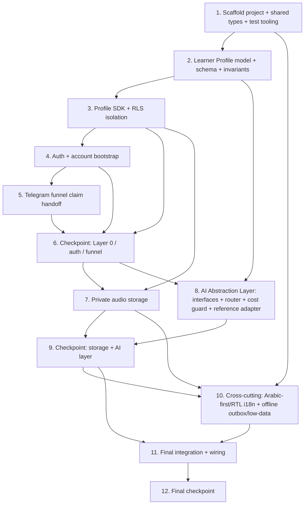

# Implementation Plan: Foundation & Infrastructure (Project P1)

## Overview

This plan converts the approved `design.md` and `requirements.md` into an incremental, test-driven sequence of coding tasks that build the Empire English Phase-1 backbone **from scratch**. Each task produces working, integrated code (no orphaned modules) and references the specific requirements it implements.

**Language & stack (locked by design §1):** TypeScript across a single React Native + Expo (Expo Router) codebase, a Supabase backend (Postgres, Auth, Storage, Realtime), and Supabase Edge Functions (Deno/TypeScript) hosting the AI Abstraction Layer. Property-based tests use **fast-check**; unit/integration tests use the project test runner (Jest/Vitest-class).

**Build sequence (by dependency):** scaffolding → Unified Learner Profile data model + Postgres schema + RLS → Profile SDK → Auth + account bootstrap → Telegram funnel claim handoff → audio capture/storage → AI Abstraction Layer (interfaces + router + cost guard + one reference adapter contract) → cross-cutting (Arabic-first/RTL i18n, offline outbox/low-data) → final wiring/integration.

**Conventions**
- Sub-tasks marked with `*` are tests and are optional (can be skipped for a faster MVP). Core implementation sub-tasks are never optional.
- Every property test references its design property number and the requirement clause it validates. Property tests run a minimum of 100 iterations.
- Scope guardrails (design §"Scope Guardrails"): this plan builds **only** P1 foundations — no placement logic (P4), accent drill/scoring logic (P5), daily loop (P6), pronunciation reference UI (P7), or concrete provider wiring beyond a single reference adapter **contract** (P2). The Speech/Language interfaces, router, cost guard, and a mock/reference adapter are in scope; real Azure/Speechace/OpenAI/Anthropic integration is **not**.

---

## Tasks

- [ ] 1. Scaffold the project, shared types, and test tooling
  - [ ] 1.1 Establish the single-codebase project structure and tooling
    - Confirm/initialize the Expo + TypeScript + Expo Router app so it builds and launches a usable app shell on iOS, Android, and web from one codebase
    - Add the Supabase JS client dependency and a typed backend-client module (single entry point the SDK will wrap)
    - Add the test runner and `fast-check`; create a `__tests__` layout and npm scripts for unit, property, and integration test runs (single-run, not watch)
    - Create an Edge Functions workspace folder (TypeScript) for the AI Abstraction Layer and funnel logic
    - _Requirements: 1.1, 1.2_

  - [ ] 1.2 Define the shared domain types (Layer 0 + AI contracts)
    - Implement the TypeScript domain model from design §4.1: `UUID`, `ISODateTime`, `Level`, `SubLevel`, `Tier`, `Region`, `DialectTendency`, `UiLocale`, `TargetSound`, `AccentSoundScore`, `AccentProfile`, `SkillScores`, `ErrorRecord`, `StreakState`, `RecordingRef`, `LearnerProfile`
    - Implement the AI contract types from design §5.1: `PhonemeScore`, `WordScore`, `PronunciationResult`, `AssessRequest`, `SpeechEngine`, `CoachingFeedback`, `FeedbackRequest`, `GenerationRequest`, `GenerationResult`, `LanguageEngine`
    - Implement the SDK and router contract types from design §5.2/§6: `AiProviderRegistry`, `CostGuard`, `AiRouter`, `AuthApi`, `ProfileApi`, `AudioApi`, `AiApi`, `AudioCapture`, `Outbox`, `EvaluationJob`
    - Export all types from a single shared module consumed by both app and Edge Functions
    - _Requirements: 3.2, 4.1, 8.2, 8.3_

- [ ] 2. Implement the Unified Learner Profile data model, schema, and invariants (Layer 0)
  - [ ] 2.1 Author the Postgres schema and migrations
    - Write the SQL migration from design §4.2: enum types (`tier_t`, `region_t`, `dialect_t`, `ui_locale_t`, `recording_kind_t`) and tables `learner_profile`, `error_record`, `recording_ref`, `funnel_claim` with their indexes
    - Add CHECK constraints for `level` (0–3) and the 12 valid sub-levels; set defaults (`ui_locale='ar'`, `tier='gate'`, `streak` JSON) and `updated_at`
    - _Requirements: 3.1, 3.2, 3.3_

  - [ ] 2.2 Implement domain validators for profile invariants
    - Implement validation/clamping for score bounds [0,100] across `overallAccentScore`, every `AccentSoundScore.score`, accent sub-metrics (`wordStress`, `linking`, `rhythm`, `intonation`), and all `SkillScores.*` — rejecting out-of-range writes and preserving the prior value
    - Implement level/sub-level validity (`level` integer in [0,3]; `sub_level` integer in [1,12]) — accept iff valid, reject otherwise
    - Implement the `updated_at` write-touch rule (set on any persisted field modification; unchanged on read)
    - _Requirements: 3.4, 3.7, 3.8, 4.6_

  - [ ] 2.3 Implement the weakest-sound derivation
    - Implement a pure function that, given an `AccentProfile`, sets `weakestSound` to the target sound with the lowest score, resolving ties by the defined target-sound ordering, and leaves it unset when no target sound has a recorded score
    - _Requirements: 3.5, 3.6_

  - [ ]* 2.4 Write property test — score bounds
    - **Property 4: Score bounds** — for any profile, all scores lie in [0,100] and out-of-range writes are rejected with the prior value retained
    - **Validates: Requirements 3.4, 3.7**

  - [ ]* 2.5 Write property test — enum validity
    - **Property 5: Enum validity** — a candidate `level`/`sub_level` is accepted iff `level` ∈ [0,3] and `sub_level` ∈ [1,12]; out-of-bounds writes rejected
    - **Validates: Requirements 3.3, 3.8**

  - [ ]* 2.6 Write property test — weakest-sound targeting
    - **Property 12: Weakest-sound targeting** — for any accent profile, `weakestSound` equals the lowest-scoring target sound (tie-broken by ordering) and is unset when none has a recorded score
    - **Validates: Requirements 3.5, 3.6**

- [ ] 3. Implement Profile access SDK and Row-Level Security (tenant isolation)
  - [ ] 3.1 Author RLS policies
    - Write SQL enabling RLS and the `own_profile`, `own_errors`, `own_recordings` policies from design §4.2 (`auth.uid() = user_id` for using + with-check)
    - _Requirements: 4.3, 4.4, 4.5_

  - [ ] 3.2 Implement the `ProfileApi` SDK
    - Implement `get`, `bootstrap` (idempotent — returns existing profile and creates no duplicate row, rejecting a second-row attempt with a profile-already-exists error), `updateScores`, `updateAccent` (invokes weakest-sound derivation), `appendError`, and `recordCoreDay`
    - Wire validators from Task 2.2/2.3 into all write paths; each operation returns the affected profile/record on success
    - _Requirements: 3.1, 3.9, 4.1, 4.2, 4.6_

  - [ ]* 3.3 Write property test — single source of truth / bootstrap idempotency
    - **Property 1: Single source of truth** — for any learner there is exactly one profile row; repeated `bootstrap` yields the same single profile identifier
    - **Validates: Requirements 3.1, 4.2, 5.3**

  - [ ]* 3.4 Write integration test — tenant isolation under RLS
    - **Property 6: Tenant isolation** — with two real auth users, A can never read/write B's profile, error history, or recordings; unauthenticated requests expose nothing
    - **Validates: Requirements 4.3, 4.4, 7.9**

  - [ ]* 3.5 Write unit tests for ProfileApi write/read paths
    - Cover `updateScores`, `appendError`, `recordCoreDay`, and the duplicate-bootstrap rejection edge case
    - _Requirements: 3.9, 4.1, 4.6_

- [ ] 4. Implement authentication and account bootstrap
  - [ ] 4.1 Implement the `AuthApi` SDK over Supabase Auth
    - Implement `signUp`, `signIn` (email/password and email OTP), `signOut`, and `getSession`; ensure issued JWT expiry ≤ 60 minutes and sign-out invalidates the session on the app within 5 seconds
    - On new-account creation, trigger idempotent profile bootstrap (reuse Task 3.2 `bootstrap`) so retries never create more than one profile; surface a safe-retry error if bootstrap fails
    - Reject invalid credentials (no session) and duplicate-email sign-up (no new profile)
    - _Requirements: 5.1, 5.2, 5.3, 5.4, 5.6, 5.7, 5.8_

  - [ ] 4.2 Enforce authenticated-session gating on protected operations
    - Ensure profile, recording, and AI operations deny missing/expired/invalid session tokens with an unauthenticated error and return no protected data
    - _Requirements: 1.6, 5.5_

  - [ ]* 4.3 Write unit/integration tests for auth flows
    - Cover sign-up/sign-in (password + OTP), JWT expiry bound, sign-out invalidation timing, invalid-credential rejection, duplicate-email rejection, and bootstrap-failure safe retry
    - _Requirements: 5.1, 5.2, 5.4, 5.6, 5.7, 5.8_

- [ ] 5. Implement the Telegram funnel claim-token handoff
  - [ ] 5.1 Implement `createFunnelClaim` Edge Function
    - Mint a single-use claim token recording Telegram id, tier, and region with `expires_at` ≤ 900s after creation; return a deep link (`empireenglish://claim?token=...`) that opens the app
    - Operate without exposing any Supabase service key to the bot
    - _Requirements: 6.1, 6.2, 6.7_

  - [ ] 5.2 Implement `redeemFunnelClaim` Edge Function and SDK method
    - Validate token (known/well-formed, unexpired, unredeemed); on success bootstrap the profile with carried tier/region/Telegram id and mark token redeemed (reuse idempotent bootstrap)
    - Reject already-redeemed (no profile change), expired (no bootstrap), and unknown/malformed (no bootstrap) tokens with the corresponding typed errors
    - Add `redeemFunnelClaim` to `AuthApi`
    - _Requirements: 6.3, 6.4, 6.5, 6.6_

  - [ ]* 5.3 Write property test — claim safety
    - **Property 7: Claim safety** — for any claim token, it is redeemable at most once and only before `expires_at`; repeated or past-expiry redemptions are rejected
    - **Validates: Requirements 6.4, 6.5**

  - [ ]* 5.4 Write integration test — funnel end-to-end (design §3.1)
    - createFunnelClaim → signUp → redeemFunnelClaim → profile bootstrapped with tier/region/Telegram id
    - _Requirements: 6.1, 6.2, 6.3_

- [ ] 6. Checkpoint — Layer 0, auth, and funnel
  - Ensure all tests pass, ask the user if questions arise.

- [ ] 7. Implement private audio storage
  - [ ] 7.1 Configure the private `recordings` bucket and storage path policy
    - Create the private Supabase Storage bucket and per-user path policy enforcing the `recordings/{userId}/` prefix
    - _Requirements: 7.4, 7.9_

  - [ ] 7.2 Implement the `AudioApi` SDK
    - Implement `getUploadUrl` (signed upload URL expiring ≤ 300s, scoped to `recordings/{userId}/`), `registerRecording` (persist kind, reference text, duration seconds, byte size, accent-score-at-time only after successful upload), `getPlaybackUrl` (signed URL expiring ≤ 3600s), and `listArchive` (owning learner's recordings, optional kind filter)
    - Reject expired/path-mismatched upload URLs without storing data; on incomplete upload, persist no metadata and return an error
    - _Requirements: 7.2, 7.3, 7.4, 7.5, 7.6, 7.7, 7.8, 7.9_

  - [ ]* 7.3 Write property test — audio path integrity
    - **Property 8: Audio path integrity** — for any recording, the signed upload URL and persisted `storage_path` are prefixed `recordings/{user_id}/` for the owning learner
    - **Validates: Requirements 7.2, 7.4**

  - [ ]* 7.4 Write property test — recording metadata round-trip
    - **Property 9: Recording metadata round-trip** — for any registered metadata, the archive returns equivalent metadata and only the owning learner's recordings matching any kind filter
    - **Validates: Requirements 7.5, 7.8**

  - [ ]* 7.5 Write integration test — record → upload → register → playback (design §3.2 storage slice)
    - Cover signed-URL upload, metadata persistence, and playback URL issuance; assert failed-upload path persists no metadata
    - _Requirements: 7.3, 7.6, 7.7_

- [ ] 8. Implement the AI Abstraction Layer (interfaces + router + cost guard + reference adapter contract)
  - [ ] 8.1 Implement the provider registry and a reference adapter contract
    - Implement `AiProviderRegistry` returning the configured Speech/Language adapters via config (no call-site change on swap)
    - Implement a single in-repo **reference/mock adapter** for each interface that returns normalized `PronunciationResult` / `CoachingFeedback` / `GenerationResult` shapes — this is the swappability contract only; do NOT wire real Azure/Speechace/OpenAI/Anthropic providers (deferred to P2)
    - Set the `provider` field server-side on every returned result
    - _Requirements: 8.4, 8.5_

  - [ ] 8.2 Implement the `CostGuard`
    - Implement `checkAllowance` (resolve op type speech/language, verify tier daily allowance before any provider call) and `recordUsage`; define the accounting window as a fixed 24h period from 00:00 UTC with per-learner reset at the boundary
    - Deny over-allowance requests with an allowance-exceeded error making no provider call and recording no usage; on provider failure, record no usage and preserve remaining allowance
    - _Requirements: 9.1, 9.2, 9.3, 9.4, 9.5, 9.6_

  - [ ] 8.3 Implement the `AiRouter` Edge Function (single AI entry point)
    - Implement `assessPronunciation`: cost-guard check → cache lookup → read audio → call Speech adapter → call Language adapter → write scores + error history to Layer 0 before returning → return `{ result, feedback, recordingId }`
    - Implement `generate`: cost-guard check → cache lookup (cache-served content is not billable) → Language adapter → usage recording
    - Return typed `AiUnavailable` on provider error/timeout or when no adapter is registered, keeping the originating job retryable and recording no partial scores
    - _Requirements: 8.1, 8.2, 8.3, 8.6, 8.7, 8.8, 9.7_

  - [ ] 8.4 Implement the client `AiApi` SDK (routes only through the backend)
    - Implement `assessPronunciation` and `generate` that call only the Edge Function router; ensure no provider SDK/endpoint and no API key is reachable from client code
    - _Requirements: 1.3, 1.4, 1.5, 8.1_

  - [ ]* 8.5 Write property test — provider isolation
    - **Property 2: Provider isolation** — for any AI request the app calls only `AiApi`; no provider SDK is reachable client-side and results always carry a server-set `provider` tag
    - **Validates: Requirements 1.3, 1.4, 8.1, 8.5**

  - [ ]* 8.6 Write property test — swappability / normalized shape
    - **Property 3: Swappability** — for any registered adapter pair, the router yields identically-shaped normalized results so call sites are unchanged
    - **Validates: Requirements 8.2, 8.3, 8.4**

  - [ ]* 8.7 Write property test — cost ceiling
    - **Property 11: Cost ceiling** — for any sequence of a learner's AI requests within a day, billable ops never exceed the tier allowance and over-allowance requests are denied before any provider call
    - **Validates: Requirements 9.1, 9.2, 9.6**

  - [ ]* 8.8 Write unit tests for CostGuard arithmetic and router error paths
    - Cover per-tier allowance arithmetic, 00:00 UTC reset, cache-served non-billable path, provider-failure no-usage path, and `AiUnavailable` (provider error + no-adapter) retryable states
    - _Requirements: 9.3, 9.4, 9.5, 9.7, 8.7, 8.8_

- [ ] 9. Checkpoint — storage and AI Abstraction Layer
  - Ensure all tests pass, ask the user if questions arise.

- [ ] 10. Implement cross-cutting foundations
  - [ ] 10.1 Implement Arabic-first / RTL i18n
    - Set up `i18next`/`react-i18next` with `ar` and `en` resource bundles; default new learners to `ar`; apply RTL via `I18nManager` using logical start/end so nothing clips or overflows
    - Persist `uiLocale` changes to the profile and apply direction within 1 second; retain prior locale and surface an error on persistence failure; fall back to `en` for missing strings; keep learning content English regardless of locale
    - _Requirements: 2.1, 2.2, 2.3, 2.4, 2.5, 2.6, 2.7_

  - [ ] 10.2 Implement offline-resilient audio capture
    - Implement `AudioCapture` (`startRecording`/`stopRecording`) producing compressed mono AAC/m4a at 24–64 kbps; persist every capture locally before any upload and confirm local persistence, surfacing an error (never silently dropping) on local-persist failure
    - _Requirements: 7.1, 10.1, 10.2_

  - [ ] 10.3 Implement the offline Outbox and low-data mode
    - Implement `Outbox` (`enqueue`/`flush`/`pending`) with persisted "pending" state while offline; on reconnect, flush FIFO (upload + submit), update each job's outcome state, and reconcile the UI within 2 seconds
    - Guarantee every accepted recording is always in exactly one observable state (evaluated, pending, or failed-with-indication) and is never removed before success or explicit dismissal; retry mid-transfer upload failures up to 5 attempts with increasing back-off, then move to terminal failed with manual retry
    - Implement low-data mode: defer non-essential downloads, prefer cached content, restrict network to active uploads/submissions
    - _Requirements: 10.3, 10.4, 10.5, 10.6, 10.7_

  - [ ]* 10.4 Write property test — offline durability
    - **Property 10: Offline durability** — for any recording accepted by `AudioCapture`, it is either successfully evaluated or remains in the Outbox (never silently lost), including after a mid-upload failure
    - **Validates: Requirements 8.7, 10.5, 10.7**

  - [ ]* 10.5 Write unit tests for i18n fallback and capture encoding
    - Cover missing-string `en` fallback, locale-persist-failure rollback, and AAC/m4a bitrate bounds (24–64 kbps)
    - _Requirements: 2.4, 2.6, 7.1_

- [ ] 11. Final integration and wiring
  - [ ] 11.1 Wire the Foundation Client SDK into the app shell
    - Compose `AuthApi`, `ProfileApi`, `AudioApi`, `AiApi`, `AudioCapture`, and `Outbox` into a single typed SDK surface; route all app data/auth/storage/AI access exclusively through it (no direct external calls); connect the deep-link claim entry path
    - _Requirements: 1.3, 1.4, 4.1_

  - [ ]* 11.2 Write end-to-end integration tests for the foundation pipelines
    - Funnel claim → signUp → redeem → bootstrap (§3.1); record → upload → assess (via reference adapter) → profile write → playback (§3.2); offline enqueue → reconnect flush → reconcile (§3.3)
    - _Requirements: 5.3, 6.3, 7.5, 8.6, 10.4_

- [ ] 12. Final checkpoint — full foundation
  - Ensure all tests pass, ask the user if questions arise.

---

## Task Dependency Graph

**Critical path:** 1 → 2 → 3 → 4 → 5 → 6 → 8 → 9 → 11 → 12. Audio storage (7) and cross-cutting (10) can proceed in parallel once their prerequisites are met.

---

## Property → Requirement → Task Coverage

| Property (design §9) | Validates Requirements | Test Task |
|----------------------|------------------------|-----------|
| 1. Single source of truth | 3.1, 4.2, 5.3 | 3.3 |
| 2. Provider isolation | 1.3, 1.4, 8.1, 8.5 | 8.5 |
| 3. Swappability (normalized shape) | 8.2, 8.3, 8.4 | 8.6 |
| 4. Score bounds | 3.4, 3.7 | 2.4 |
| 5. Enum validity | 3.3, 3.8 | 2.5 |
| 6. Tenant isolation | 4.3, 4.4, 7.9 | 3.4 |
| 7. Claim safety | 6.4, 6.5 | 5.3 |
| 8. Audio path integrity | 7.2, 7.4 | 7.3 |
| 9. Recording metadata round-trip | 7.5, 7.8 | 7.4 |
| 10. Offline durability | 8.7, 10.5, 10.7 | 10.4 |
| 11. Cost ceiling | 9.1, 9.2, 9.6 | 8.7 |
| 12. Weakest-sound targeting | 3.5, 3.6 | 2.6 |

---

## Notes

- Tasks marked with `*` are optional test sub-tasks and can be skipped for a faster MVP; core implementation sub-tasks are never optional.
- Each task references specific requirement clauses for traceability and aligns with the design's components, interfaces, and sequence diagrams.
- Property-based tests (fast-check, ≥100 iterations) validate the universal invariants in design §9; unit tests cover specific examples/edge cases; integration tests exercise the §3 pipelines and RLS with real auth users.
- **Scope guardrails honored:** no Phase 2+ features and no P2–P8 feature logic. The AI layer delivers interfaces + router + cost guard + a single reference/mock adapter **contract** only; concrete provider wiring is deferred to P2. All tasks are coding/implementation activities — no deployment, marketing, or user-testing tasks.
